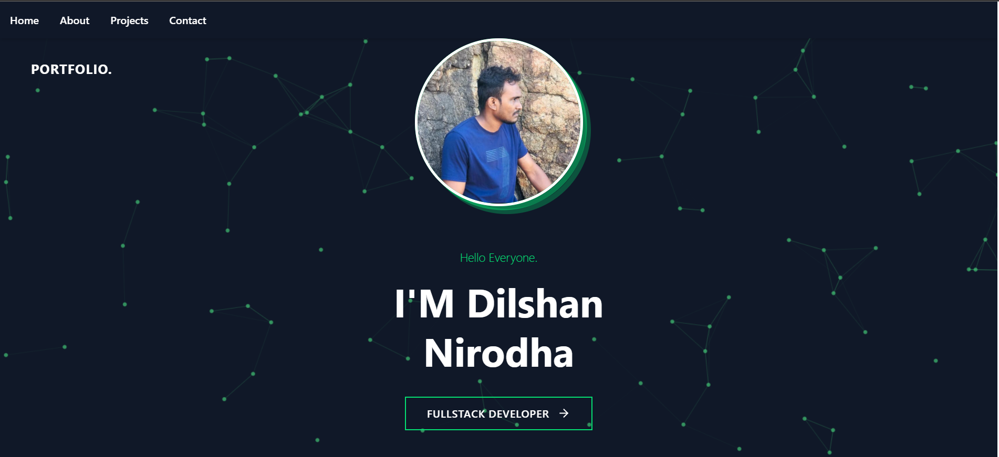
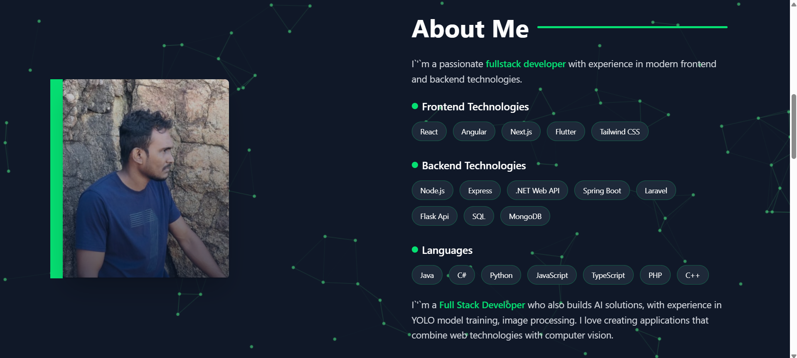
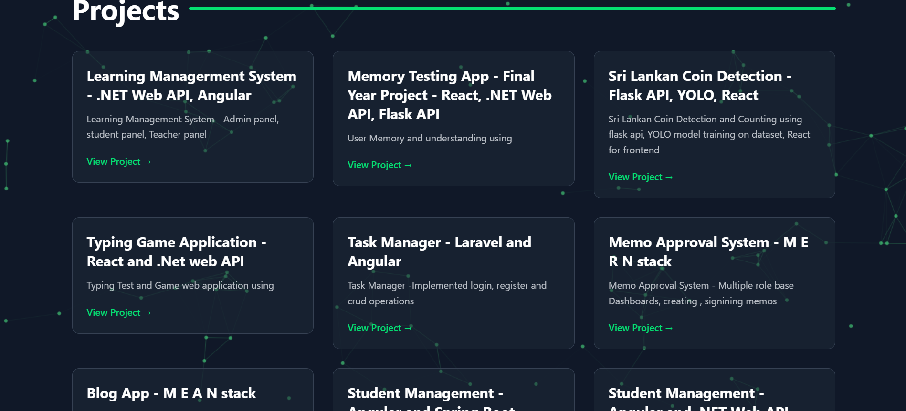
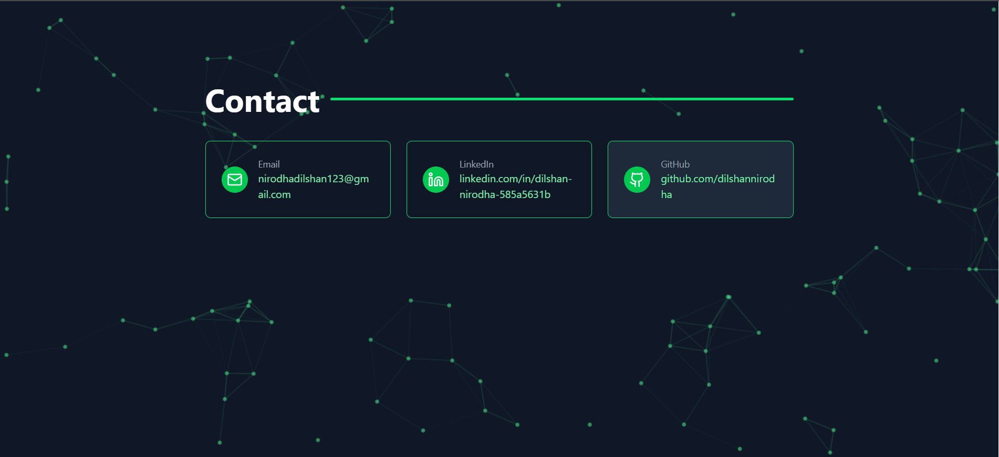

## 📸 Screenshots

<table>
  <tr>
    <td align="center">
       
      <b>Home</b>
    </td>
    <td align="center">
       
      <b>About</b>
    </td>
     <td align="center">
       
      <b>Projects</b>
    </td>
     <td align="center">
       
      <b>Contacts</b>
    </td>
  </tr>
</table>

## 📋 Description

**PORTFOLIO** is a website built with Next.js that shows my projects and skills. 
-Background animations
-responsive

---

## 🛠 Tech Stack

- 🎯 **Frontend**: Nextjs, tailwind CSS
- 
---
## 🎮 Live Demo
🔗 [Try it now on GitHub Pages](🔗 dilshannirodha.github.io/portfolio---NextJs/)

---

